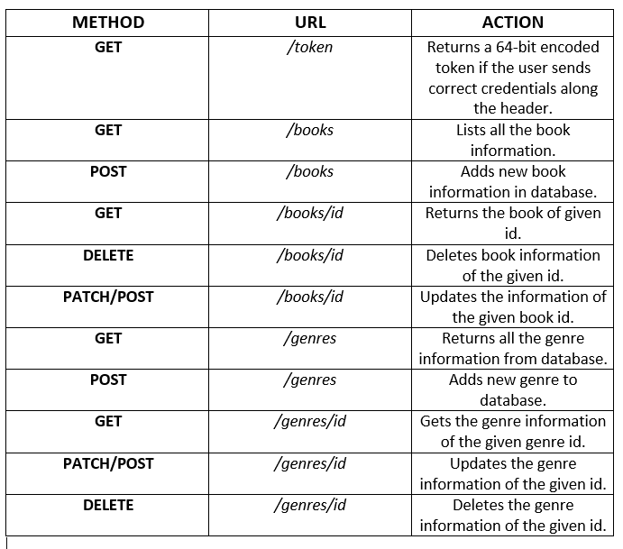

## Simle Bookstore API 

- Users can Create, Read, Update and Delete book information.
- Book Genres can be added and updated too.
- Used simple JWT(JSON Web Token) based authentication.
- Users who have an account can get a token for API operations for a fixed length of time.
- After the token expires, user has to get a new token.

Here's the API details.

